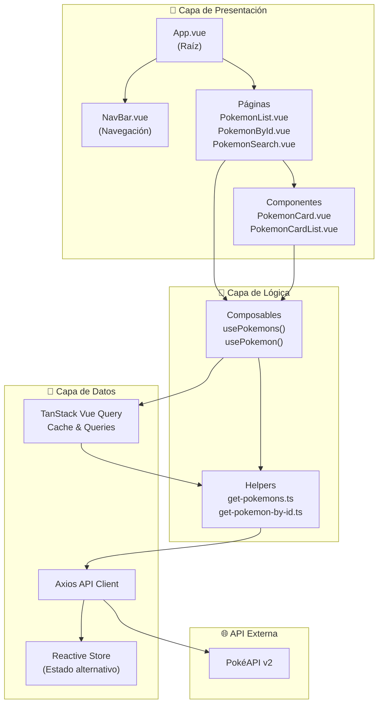
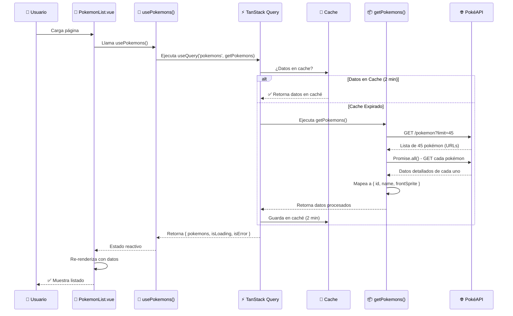
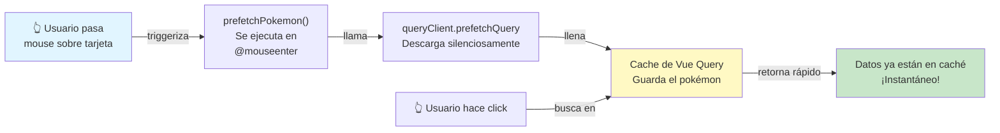
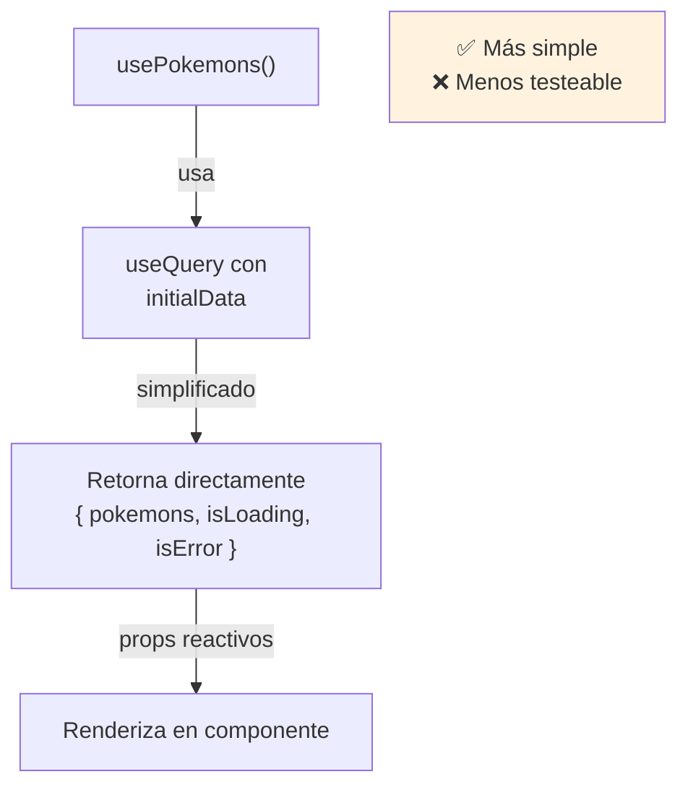
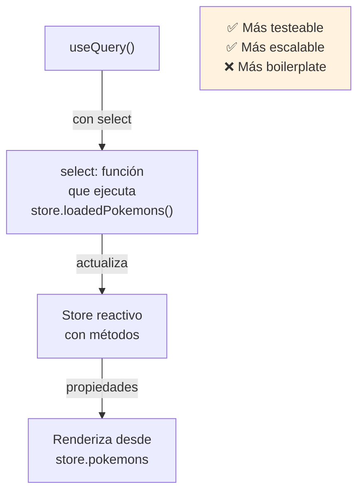
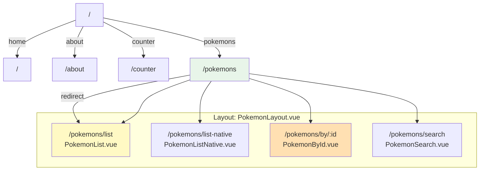
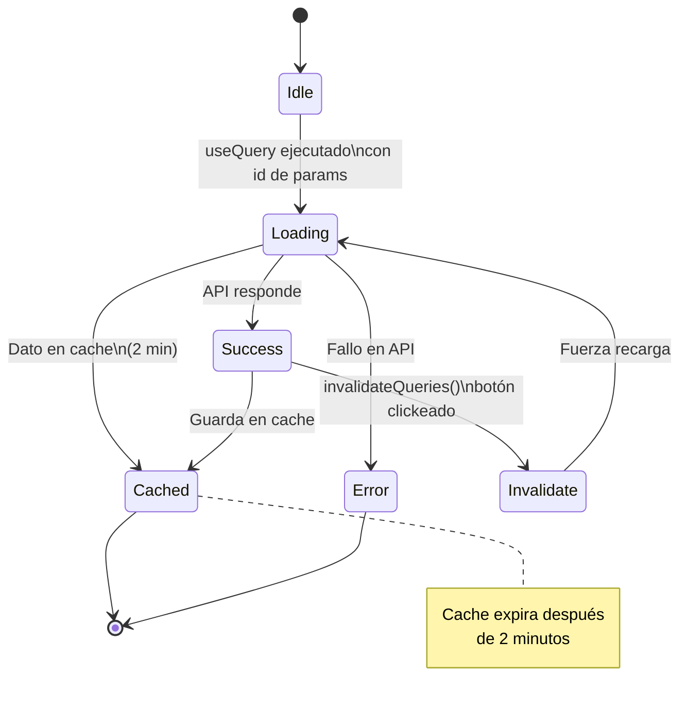
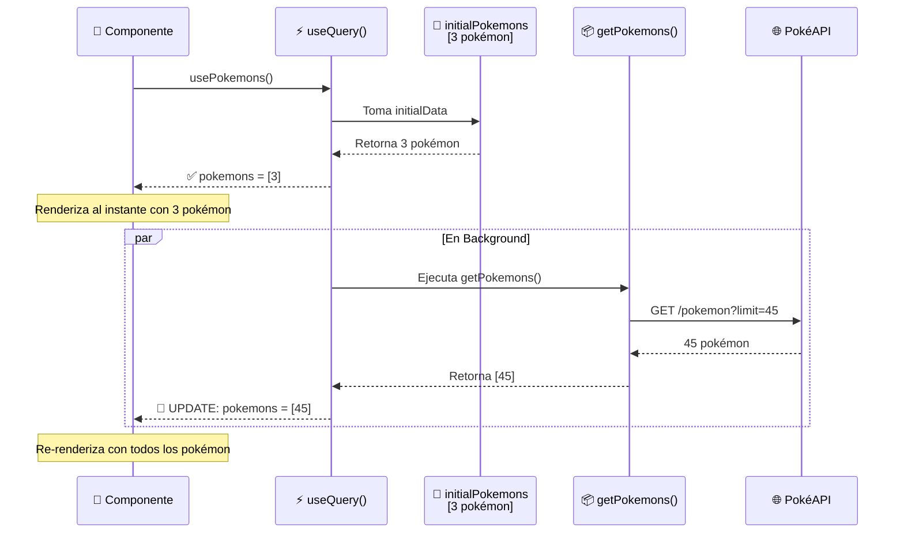

# vue-router-composable-suspense-tanstack-vuequery-prefetching

Este proyecto de indole educativa, se hizo siguiendo los pasos de las secciones 3, 4 y 5 del curso de https://www.udemy.com/course/vue-intermedio hecho por F.Herrera.

---

## 📚 Análisis Educativo del Proyecto

### 🎯 **Descripción General**

Este proyecto enseña **5 conceptos avanzados de Vue 3**:
1. **Vue Router 4** - Enrutamiento dinámico y layouts anidados
2. **Composables** - Lógica reutilizable con Composition API
3. **Suspense** (preparado pero se dejó como código comentado)
4. **TanStack Vue Query** - Gestión de estado asincrónico y caché
5. **Prefetching** - Precarga inteligente de datos

---

### 📐 **Arquitectura General del Proyecto**



---

### 🔄 **Flujo de Datos - Ciclo Completo**



---

### 🚀 **Sistema de Prefetching - La Característica Clave**



---

### 📊 **Comparación: Dos Enfoques de Gestión de Estado**

#### **Opción 1: PokemonList.vue (Solo Vue Query)**


#### **Opción 2: PokemonListNative.vue (Vue Query + Store)**


---

### 🎭 **Enrutamiento Jerárquico con Layout en /pokemons**
En el caso de /pokemons, el component de la ruta es el PokemonLayout, y el resto va en los children.



---

### 🧬 **Ciclo de Vida de Vue Query en PokemonById.vue**



---

### 🔧 **Configuración Inicial de TanStack Query**

```javascript
// En main.ts se configura globalmente:
VueQueryPlugin.install(app, {
  queryClientConfig: {
    defaultOptions: {
      queries: {
        cacheTime: 1000 * 120,        // ⏱️ Datos válidos 2 minutos
        refetchOnReconnect: 'always', // 🔄 Re-fetch si reconnecta
      }
    }
  }
});
```

---

### 📦 **Estructura de Composables**

#### **usePokemons() - Lista completa con Instant Feedback Pattern**

El composable `usePokemons()` implementa una estrategia inteligente de UX usando `initialData` (es el caso que no usa Store, Solo Vue Query):

```javascript
const { isLoading, data:pokemons, isError, error } = useQuery(
  ['pokemons'],
  getPokemons,
  {
    retry: 0,
    initialData: initialPokemons,  // ← 3 pokémon predefinidos
  }
);

// Retorna:
{
  pokemons,      // Array - primero initialPokemons (3), luego getPokemons (45)
  isLoading,     // boolean - cargando?
  isError,       // boolean - error?
  error,         // objeto Error
  count: computed(() => pokemons.value?.length ?? 0)  // count reactivo
}
```

**¿Cómo funciona?**



**Ventajas:**
- ✅ Usuario ve datos **al instante** (no espera cargando)
- ✅ Mejor UX: transición suave de 3 → 45 pokémon
- ✅ Si la API falla, al menos tiene 3 pokémon iniciales
- ✅ En caché (< 2 min), usa los 45 sin petición adicional

---

#### **usePokemon(id) - Pokémon individual**
```javascript
// Retorna:
{
  pokemon,          // un pokémon
  isLoading,        // boolean
  isError,          // boolean
  errorMessage      // error
}
// La clave cambia con el ID: ['pokemon', id]
```

**Diferencia:** Usa `queryKey: ['pokemon', id]`, permitiendo caché separado por cada pokémon.

---

### 💡 **Conceptos Clave Enseñados**

| Concepto | Ubicación | Lección |
|----------|-----------|---------|
| **Script Setup** | `.vue files` | Azúcar sintáctico moderno |
| **Reactive Props** | PokemonCard.vue | `defineProps<Props>()` typed |
| **Lifecycle Hooks** | Composables | No usados aquí (Vue Query maneja) |
| **Router Navigation** | PokemonCard.vue | `router.push()` con params |
| **Computed Properties** | usePokemons.ts | `computed(() => ...)` |
| **Watch Effects** | usePokemons.ts | `watchEffect()` (sin usar) |
| **Query Keys** | Composables | Invalidación por keys |
| **Prefetching** | PokemonCard.vue | `prefetchQuery()` on hover |
| **Data Transformation** | get-pokemons.ts | Mapeo de API response |
| **Error Handling** | Pages | Condicionales con `v-if/else` |
| **Store Pattern** | store.ts | Reactive store alternativo |
| **TypeScript Interfaces** | `/interfaces/*` | Tipos para API responses |

---

### 🎓 **Lecciones de Arquitectura**

```
┌─────────────────────────────────────────────────┐
│  SEPARACIÓN DE RESPONSABILIDADES                │
├─────────────────────────────────────────────────┤
│  Componentes (.vue)   → UI solamente            │
│  Composables (.ts)    → Lógica reutilizable    │
│  Helpers (.ts)        → Transformación de datos│
│  API (.ts)            → Cliente HTTP            │
│  Interfaces (.ts)     → Contrato de tipos      │
│  Store (.ts)          → Estado global (alt.)   │
│  Router              → Navegación               │
└─────────────────────────────────────────────────┘
```

---

### 🚦 **Estados de UI Manejados**

```mermaid
graph TD
    Query["useQuery()"]
    
    Query --> L["isLoading = true"]
    Query --> E["isError = true"]
    Query --> S["¡Datos!"]
    
    L --> UI1["Mostrar 'Loading...'"]
    E --> UI2["Mostrar error message"]
    S --> UI3["Renderizar datos"]
    
    style L fill:#000
    style E fill:#000
    style S fill:#000
```



---

Esta estructura sigue **padrón profesional moderno** y enseña cómo construir aplicaciones Vue escalables con gestión robusta de estado asincrónico.